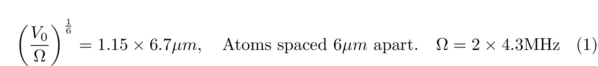

### Creating the Checkerboard Phase

If the blockade is big enough, we can make some interesting patterns with the ground and Rydberg states. The simplest of these interesting states is the checkerboard phase. The checkerboard phase is an interesting pattern where atoms atoms on the grid alternate between the ground state, and the excited Rydberg state. The smallest blockade distance for which this is possible is when we've configured the system to have 

Once we've set the atoms in this pattern, we then work on exciting the array of atoms with lasers. First, the array of atoms are excited with lasers whilst keeping a constant Rabi. We can create an ordered phase for a quantum many body system by slowly detuning the atoms with some interference. By dynamically sweep the tuning  \Delta   from negative to positive, we can create this checkerboard pattern. This checkerboard phase is interesting because it is an equilibrium state, but symmetry is broken here since there are two possible distinct checkerboard states. 

 

[image is not supported]

 

### Excitations of Two-Level Quantum States

How does this process work? In the previous article, I described our set-up as an array of atoms, each with two possible quantum states. To keep things tight, let's simplify the situation slightly. Consider a single atom which has two quantum levels, the ground state and the Rydberg state. Suppose we expose it to some lasers. Lasers are just concentrated beams of light, and light is an electric and magnetic wave. What happens when we expose a two-level quantum state to some driving wave [1]? 

[image is not supported]

When we expose a two-state electron to an electromagnetic field, the probability of finding the electron in an excited state is given in the below. The mathematical model here are the Bloch equations, since this scenario is similar to just a 1/2-spin particle, since 1/2-spin particles also have just two energy eigenstates. The Rabi frequency is given by the Greek letter Omega. The term on the left is the probability that we find the atom in an excited state. As you can see, the probability amplitude oscillates as a function of time. 

### An Analysis of the Hilbert Space 

Our Hilbert space is a vector space with two basis vectors, the Intuitively, the atom cycles between absorbing and re-emitting photons. The Hamiltonian for a two state system should give us the correct energy when we contract it with either the ground state or the excited state. The first term gives us the expected energy from the ground state, and the second term gives us the expected energy from the excited sate. 

Our state-space is two-dimensional, which means that we have just four linearly independent operators. A common choice of operators are the following four matrices sigma-z, sigma-plus, sigma-minus, and the identity matrix. Physically, sigma-plus and sigma-minus represent operators that shift states up and down respectively between the ground and Rydberg [states.](http://states.You) It is each to check that this is true by contracting these operators with either the excited state or the ground state. 

We can rewrite the Hamiltonian as the sum of two parts. The first part adds the two states together, and the second part looks at the difference (which is called the inversion). The second part in the Hamiltonian is the interesting part. In the first term of the second line, we note that the Hamiltonian is actually the same. This is because if we contract it with the gound end excited states, we get the same expected values. 

 

### The Dipole approximation 

We can simplify the problem by modelling the atom as a dipole in an oscillating field. A hydrogen-like atom consists of a postively charged particle and a negatively charged electron. So, it looks like a dipole. The dipole moment can be represented as the position vector from the nucleus to the electron.

### References 

[1] [https://en.wikipedia.org/wiki/Rabi_problem](https://en.wikipedia.org/wiki/Rabi_problem)

[2] [https://en.wikipedia.org/wiki/Rabi_cycle](https://en.wikipedia.org/wiki/Rabi_cycle)

[3] [http://www.rp-photonics.com/rabi_oscillations.html](http://www.rp-photonics.com/rabi_oscillations.html)

[4] [https://ocw.mit.edu/courses/electrical-engineering-and-computer-science/6-974-fundamentals-of-photonics-quantum-electronics-spring-2006/lecture-notes/chapter6.pdf](https://ocw.mit.edu/courses/electrical-engineering-and-computer-science/6-974-fundamentals-of-photonics-quantum-electronics-spring-2006/lecture-notes/chapter6.pdf)

[5] I. I. Rabi: "Space Quantization in a Gyrating Magnetic Field," Phys.
Rev. 51, 652-654 (1937).

[6] [https://web.pa.msu.edu/people/mmoore/Lect31_DipoleMoments.pdf](https://web.pa.msu.edu/people/mmoore/Lect31_DipoleMoments.pdf)

 

